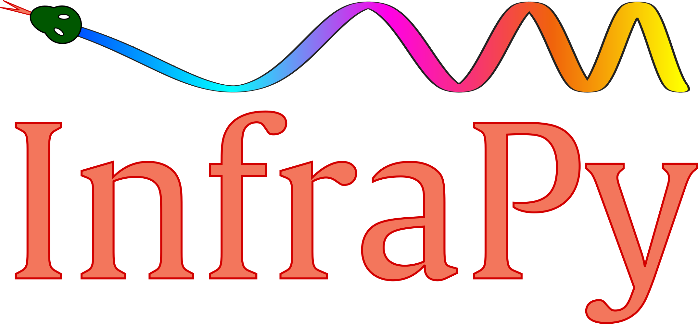

InfraPy: Infrared Image Processing in Python
=============================================
**InfraPy** is a modular Python library for infrared image analysis, with a strong foundation in thermography and thermoelastic stress analysis (TSA). It provides a clean and extensible structure for processing, analyzing, and visualizing infrared data, while remaining open to future expansions beyond TSA and classical thermography.

The library is designed to serve research, engineering, and diagnostic applications where infrared imaging is key — from temperature field exploration to dynamic lock-in analysis.

Features
--------

-  **Flexible input support**: image stacks, video files, NumPy arrays, CSV
-  **Temperature tools**: emissivity correction, radiometric-to-temperature conversion
-  **Preprocessing**: detrending, filtering, normalization, cropping
-  **Visualization**: ROI monitoring, line profiles, area averages, video animation
-  **Time-domain analysis**: temperature monitoring, basic ROI tracking
-  **Frequency-domain analysis**: TSA lock-in, adaptive lock-in, amplitude and phase mapping
-  **Utility tools**: windowing, unit conversion, SNR calculation, resampling
-  **Modular design**: clean architecture to support GUI/CLI integration and future analysis modules

Installation
------------

Install via pip (once published):

.. code-block:: bash

    pip install infrapy

Or install from source:

.. code-block:: bash

    git clone https://github.com/LolloCappo/infrapy.git
    cd infrapy
    pip install -e .

Project Structure
-----------------

.. code-block:: text

    infrapy/
    ├── io/
    │   ├── readers.py              # Load IR data from files
    │   └── writers.py              # Save processed data and results
    ├── temperature/
    │   ├── emissivity.py           # Emissivity corrections
    │   └── calibration.py          # Radiometric ↔ temperature scaling
    ├── preprocessing/
    │   ├── detrending.py           # Remove temporal drift
    │   ├── filters.py              # Temporal/spatial filters
    │   ├── normalization.py        # Normalize across time or space
    │   └── cropping.py             # Spatial/temporal cropping
    ├── visualization/
    │   ├── roi.py                  # Define ROIs (point, line, area)
    │   ├── plots.py                # Plot signals, maps, profiles
    │   └── animation.py            # Animate sequences of IR data
    ├── analysis/
    │   ├── time_domain/
    │   │   ├── thermography.py     # Classical temperature field tracking
    │   │   └── spatial_features.py # Gradients, contrast-based maps
    │   ├── frequency_domain/
    │   │   ├── thermoelastic_stress.py  # TSA: lock-in amplitude/phase
    │   │   └── adaptive_lockin.py       # Auto-detecting lock-in frequency
    │   └── utilities.py           # Shared tools: windowing, correlation, etc.
    ├── utils.py                   # General-purpose utilities:
    │                              #  - Unit conversions
    │                              #  - Signal-to-noise ratio
    │                              #  - Frame resampling
    │                              #  - Frame sequence helpers
    ├── gui/                       # GUI frontend module
    ├── cli/                       # CLI interface tools
    ├── examples/                  # Jupyter notebooks and usage demos
    ├── tests/                     # Unit and integration tests
    ├── pyproject.toml             # Build & dependency configuration
    └── README.rst                 # This file

Planned Extensions
------------------

- TSA calibration routines for absolute stress estimation
- Thermal anomaly detection tools
- GUI frontend for interactive workflows
- Built-in batch ROI analysis and CSV export

Getting Started
---------------

Coming soon: example notebooks in the ``examples/`` folder for:

- Loading and displaying IR image sequences
- Performing lock-in thermoelastic analysis
- Monitoring temperature in selected ROIs
- Filtering and normalizing noisy thermal data

Contributing
------------

Feel free to contribute! Open issues for bug reports, feature suggestions, or development help. Pull requests are welcome.

License
-------

MIT License

Contact
-------

Project Lead: Lorenzo Capponi
Email: lorenzocapponi@outlook.it
GitHub: https://github.com/LolloCappo/infrapy
